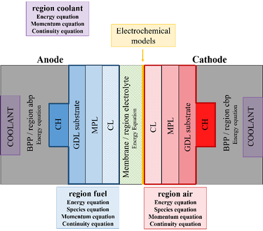
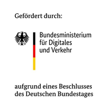

# OpenFoamZSWPemfcToolbox

## OpenFOAM v7
The pemfcFOAM solver is based on OpenFOAM v7 that can be downloaded under: https://openfoam.org/version/7/

## This toolbox is base on pemfcSinglePhaseModel-4.0

The development is based on the pemfcSinglePhaseModel-4.0, which is published under CC BY 4.0 under: https://unnc.digitalcommonsdata.com/datasets/3gz7pxznzn/1 (DOI: 10.17632/3gz7pxznzn.1)

This model is a 3-D, non-isothermal and single-phase flow model for simulation of PEM fuel cells. Assumptions of the electrochemical model are:
- steady-state operating condition
- gas flow: laminar and incompressible, ideal gas
- fuel cell components: isotropic and homogenous
- electrochemical reaction is modelled at cathode catalyst layer membrane interface (2D)
- membrane: fully humidified, impermeable to reactant gases
- anode: activation overpotential and mass transport losses are neglegted
- ohmic heating not considered 

## Features/Modification compared to pemfcSinglePhaseModel-4.0
The pemfcSinglePhaseModel-4.0 was updated from OpenFOAM v4 to OpenFOAM v7. Some inconsistencies in the code concerning modelling of porous media, gas mixture on anode side, source term of energy equation and possibility for parallel calculation have been fixed.

New implentations are:
- implementation of coolant flowfield and MPL properties
- more realistic membrane humidity: average of anode and cathode relative humidity
- considering anode activation overpotential
- implementation of Butler-Vollmer equation (assumption: alpha equal on anode and cathode) for modelling of activation overpotential of anode and cathode
- implementation of hydrogen crossover
- implementation of "postProcessing" functionality of OpenFOAM
- implementation of "fvOption" functionality of OpenFOAM (e.g. fixed values can be defined)

A schematic description of the pemfcFoam solver and the convergence procedure are illustrated below.

### Sketch of assumed cell setup

### Convergence procedure

## Documentation
At the moment there is no formal documentation of the pemfcFOAM solver beside this README file available. An example is prepared as described below. A journal publication is planned in future.

# Getting started
The pemfcFoam solver can be used in OpenFOAM v7.To get started the OpenFoamZSWPemfcToolbox has to be copied to user home directory. Then OpenFOAM version must be loaded and the pemfcFoam code can be compiled by running Allwmake. 

# Example
An examplary case for the pemfcFOAM solver is prepared. It decribes a single channel model of ZSW 300 cm² automotive design (graphite BPP) operated under automotive operating conditions. The detailed description can be found in the [Description_Example_pemfcFoam.pdf](Example/Description_Example_pmfcFoam.pdf) file.

# Publications

1. Conference Presentation (Oral)  
   S. Schneider (Corresponding author), F. Wilhelm, J. Scholta, L. Jörissen, M. Koprek   
   **Advancement and validation of OpenFOAM PEMFC toolbox on automotive PEMFC design**  
   19th Symposium on Fuel Cell and Battery Modeling and Experimental Validation - MODVAL, Duisburg, Germany, 21 Mar 2023 - 23 Mar 2023
2. Conference Presentation (Poster)   
   S. Schneider (Corresponding author), F. Wilhelm, J. Scholta, L. Jörissen, M. Koprek   
   **Advancement of an OpenFOAM PEMFC toolbox and its validation an an automotive cell design**  
   18th Ulm Electrochemical Talks - UECT, Ulm, Germany, 14 Jun 2023 - 15 Jun 2023
  

# Feedback

# Development / How to contribute

<!---
--- ? Include links to speparate files ("Contribution guidelines" and "Roadmap") ? ---
--->

# Acknowledgements

## Developed within the project AutoStack Industrie - ASI

The toolbox was developed within the ASI-Project. Funded by the German Federal Ministry of Transport (grant number: 03B10103), the “AutoStack-Industrie” joint project with 10 industry partners was launched to develop a high-performance fuel cell stack suitable for series production for automotive applications and was successfully completed in 2022.

Related links:

https://www.zsw-bw.de/en/newsroom/news/news-detail/news/detail/News/fuel-cell-powered-e-mobility-autostack-industry-project-sets-the-stage-for-mass-fuel-cell-manufa.html

https://www.now-gmbh.de/en/projectfinder/autostack-industrie/

   

<!---
## Funding

## Cotributors

# Copyright and License

## OpenFOAM Licence (GPLv3)
"OpenFOAM is distributed by the OpenFOAM Foundation and is freely available and open source, licensed under the GNU General Public Licence.

There are two main elements to the GPL, designed to prevent open source software being exploited by their inclusion within non-free, closed sourced software products:

1. Software that includes source code licensed under the GPL inherits the GPL licence.
2. If compiled binaries of software licensed under GPL are distributed, the source code must also be made available by the distributor.

These aspects of the licence discourage exploitation, because if a closed sourced software product that includes open source software is sold for a fee, anyone purchasing the product could demand the source code and redistribute it for free.

Apart from this, the licence is designed to offer freedom, in particular it does not force users of the software to make modifications or developments publicly available. That means that software such as OpenFOAM can be used as the basis of in-house software." [https://openfoam.org/licence/]
--->

# Contact 📫

https://www.zsw-bw.de/en/research/fuel-cells/topics/modelling-and-simulation.html

ec-sim@zsw-bw.de
